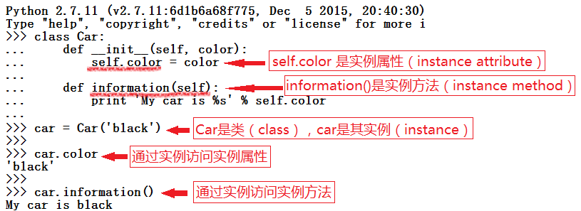
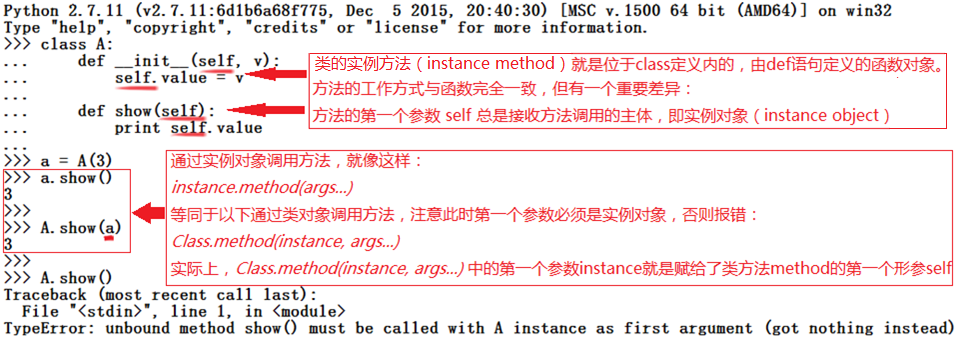
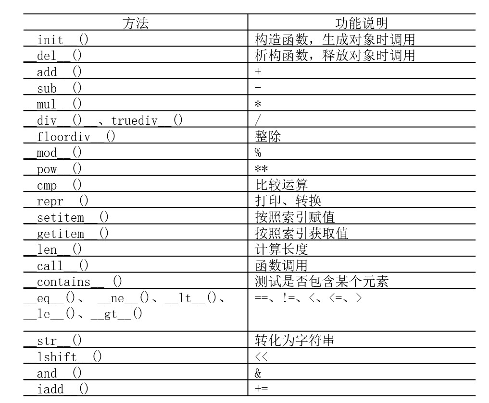
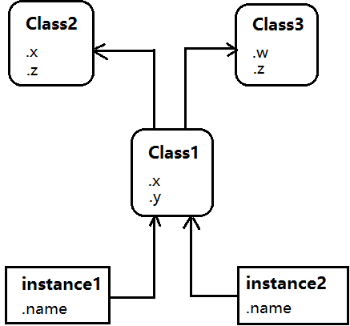
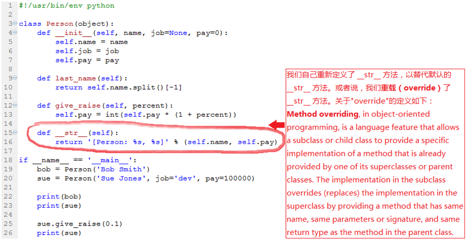
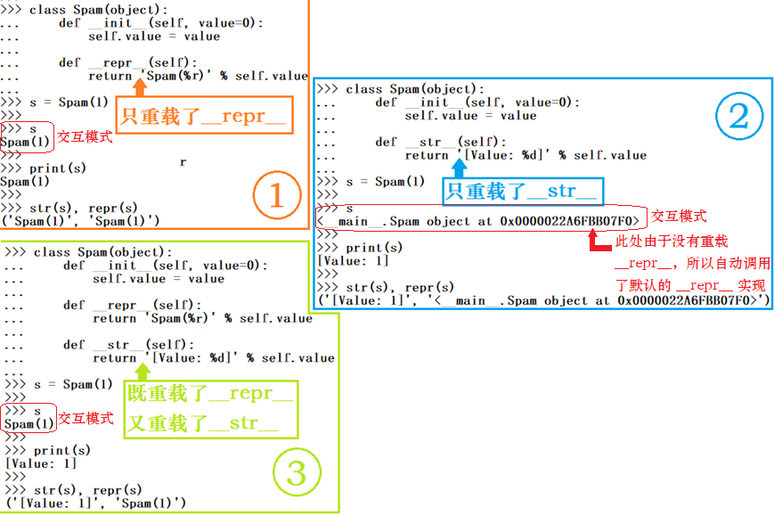
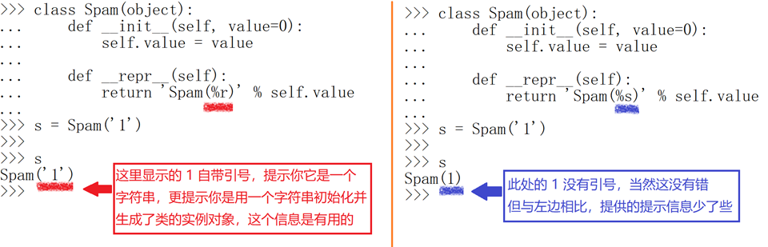

# Practice Content

2. 编写代码，定义一个名叫为 ListInstanceAttr 的类，显示从一个实例可以访问的所有属性名及其值。再将这个 ListInstanceAttr 类作为超类，用在多重继承中，看一看运行结果。提示：参考一下 “第6章__面向对象程序设计_1.pptx”的第51页。可能需要使用内置函数 getattr 以及 dir，比如：dir(self)


- 内省（introspection）是指计算机程序在运行时（run time）检查对象（object）类型的一种能力，也称作运行时类型检查（run-time type checking）

- Introspection is an act of self examination. In computer programming, introspection is the ability to determine the type of an object at runtime.
- Python提供了可用于内省的工具，它们是类的一些特殊属性和函数，允许我们访问对象实现的一些内部机制。比如 `instance.__class__` 和 `instance.__dict__`。

# 1. OOP
- 面向对象程序设计（Object Oriented Programming，OOP）

- 主要思想：针对大型软件设计而提出，使得软件设计更加灵活，支持代码复用和设计复用，使得代码具有更好的可读性和可扩展性。

- 一个基本原则：计算机程序由多个能够起到子程序作用的单元或对象组合而成，降低了软件开发的难度。

- 一个关键观念：将数据以及对数据的操作封装在一起，组成一个相互依存、不可分割的整体，即对象（object）。

- 对于相同类型的对象进行分类、抽象后，得出共同的特征而形成了类（class）。

- 面向对象程序设计的关键：如何合理地定义和组织这些类以及类之间的关系。

---
# 2. Python OOP
- 相同：Python完全采用了面向对象程序设计的思想，是真正面向对象的高级动态编程语言，完全支持面向对象的基本功能，如封装、继承、多态以及对基类方法的覆盖或重写。
- 不同：Python中对象的概念很广泛，Python中的一切内容都可以称为对象例如，字符串、列表、字典、元组等内置数据类型都具有和类完全相似的语法和用法!

## 2.1 类的定义
- 驼峰命名法（CamelCase）：`class CamelCase: pass`，即组成类名的单词的首字母要大写!
- `pass` 占位符

---
定义了类（class）之后，可以创建其实例（instance）：

- 访问实例属性：`instance.attribute`
- 访问实例方法：`instance.method( )`


## 2.2 self 参数
- 类的所有实例方法都必须至少有一个名为 self 的参数，并且必须是方法的第一个形参（如果有多个形参的话）
- <font color=red> self 参数代表将来要创建的实例对象本身 </font>
- 在外部通过实例对象调用方法时不需要传递这个self参数



## 2.3 常用特殊方法
- Python中类的**构造函数**是 `__init__()`，用来**为数据成员设置初值或进行初始化**，<font color=red>在创建对象时被自动调用执行</font>；
- 如果用户没有定义自己的构造函数，Python将提供一个默认的构造函数用来进行必要的初始化工作；
- Python中类的**析构函数**是 `__del__()`，用来**释放对象占用的资源**，在Python删除对象和收回对象空间时被自动调用和执行。
- 如果用户没有编写析构函数，Python将提供一个默认的析构函数进行必要的清理工作；



# 3. 继承 (inheritance)
- 继承（inheritance）是为代码复用和设计复用而设计的，是面向对象程序设计的重要特性之一。
- 在继承关系中，已有的、设计好的类称为父类、基类或超类，新设计的类称为子类或派生类。
- 在Python中，类（class）和通过类产生的实例（instance）是两种不同的对象类型
- 类和实例都是对象（object）
---
- 下图中，底端有两个实例（instance1和instance2），在它们上面有个类（Class1），顶端有两个超类（Class2和Class3）
- 继承就是由下至上，由左至右搜索这个树，以寻找属性名称所出现的最低的地方


---
- 对于instance2.w，Python会按这个顺序搜索连接的对象：instance2，Class1，Class2， Class3。直到搜索到Class3时才找到w。我们说，instance2从Class3中继承了属性w；
- instance1.x和instance2.x都会在Class1中找到x并停止搜索，因为Class1比Class2位置低
- instance1.y和instance2.y都会在Class1中找到y，因为这是y唯一出现的地方
- instance1.z和instance2.z都会在Class2中找到z，因为Class2比Class3更靠左侧
- instance2.name会找到instance2中的name，不需要“爬树”


```python
<font color=red> </font>
```

## 3.1 添加行为方法
- 使用封装（encapsulation）的思想，把操作逻辑包装到界面之后，从而对外隐藏对象的具体实现细节。
- 把操作对象的代码放在类定义中，使其成为类的方法。
- 把对类属性的操作放入类定义中，成为类的实例方法，使得这些操作可以用于类的任何实例。好处：减少代码冗余，方便维护。
- 类的实例方法（instance method）只不过是附加给类，并旨在处理那些类的实例的常规函数。
- 实例（instance）是方法调用的主体，并且会被自动地传递给类的实例方法的名为 self 的参数。

## 3.2 运算符重载
- 使用运算符重载（operator overloading）在类中编写某些方法，当这些方法在类的实例中运行时，其可以截获并处理某些内置的操作。
- 比如重载 __str__ 方法。这样每次一个实例转换为其打印字符串的时候， __str__ 方法都会自动运行。
- 如果不定义 __str__ 方法，那么我们定义的类就会从它的超类继承 __str__ 方法。即要么自己定义一个该方法，要么从一个超类继承一个该方法。


## 3.3 __str__ 和 __repr__辨析
- `__str__` 和 `__repr__` 都必须返回字符串
- `__repr__` 用于任何地方，除非重载了 `__str__`。
- 在交互模式（interactive mode），只会用 `__repr__`。此时即使重载了`__str__`，也不会被用到。


---
- `__str__` 和 `__repr__` 两个显示方法是为了进行“用户友好”的显示!
- Rule of thumb:  `__repr__` is for developers, `__str__` is for customers.
- 可以通过重载让 `__str__` 显示简洁的信息，而让 `__repr__` 显示包括内存地址在内的详细的对象信息，以便程序员调试。
- <font color=red> 如果想让所有环境都有统一的显示，那就只重载__repr__ </font>

---
在实践中，经常需要在log中记录对象的信息以供debug，此时，你一定想要一个精心设计的、可以显示对象关键信息的 `__repr__`。

```python
import logging

log(INFO, 'I am in the weird function and a is', a, 'and b is', b)
```

如果你没有一个合适的 `__repr__`，那么在上例中最终打印（或存储）的日志里的对象 a 和 b 的信息就可能对debug没有多大用。这里也正体现出 `__repr__` 的作用：for understanding the object。

### 字符串格式化符 %r

- `%r`: String （repr()）
- `%s`: String （str()）




```python
class Person(object):
    def __init__(self, name, job=None, pay=0):
        self.name = name
        self.job = job
        self.pay = pay
        
    def last_name(self):
        return self.name.split()[-1]
    
    def give_raise(self, percent):
        self.pay = int(self.pay * (1 + percent))
        
    def __str__(self):
        return '[Person: %s, %s]' % (self.name, self.pay)
    

class Manager(Person):
    def give_raise(self, percent, bonus=0.1):
        # 此种实现方式，方便代码维护，减少修改的地方
        Person.give_raise(self, percent + bonus)
        
        
if __name__ == '__main__':
    bob = Person('Bob Smith')
    # 如果在创建Manager实例对象时可以有某种方式自动填入job=‘manager’这个参数，就更好了
    tom = Manager('Tom Jones', 'manager', 500000)
    
    print(bob)
    print(tom)
```

    [Person: Bob Smith, 0]
    [Person: Tom Jones, 500000]
    

## 3.4 使用内省(introspection)工具

需求：如果想在打印经理 tom 时输出 "Manager"，该如何做？

想法：有没有办法让实例对象自己知道自己的类的相关信息？

实现：使用内省工具。

---
Python提供了可用于内省的工具，它们是类的一些特殊属性和函数，允许我们访问对象实现的一些内部机制。比如 `instance.__class__` 和 `instance.__dict__`

- **内省（introspection）** 是指计算机程序在运行时（run time）检查对象（object）类型的一种能力，也称作运行时类型检查（run-time type checking）

---
ref:
> 1. https://en.wikipedia.org/wiki/Type_introspection
> 2. http://zetcode.com/lang/python/introspection/
> 3. https://stackoverflow.com/questions/510972/getting-the-class-name-of-an-instance-in-python

The inspect module provides several useful functions to help get information about live objects:
> 4. https://docs.python.org/2/library/inspect.html
> 5. https://docs.python.org/3/library/inspect.html


```python
class AttrDisplay(object):
    
    def gather_attrs(self):
        attrs = ['%s = %s' % (key, getattr(self, key)) for key in sorted(self.__dict__)]
        return ', '.join(attrs)

    def __str__(self):
        return '[%s: %s]' % (self.__class__.__name__, self.gather_attrs())
```

- `getattr(object, name)` 是Python的内建函数。
- `__class__` 为实例属性


```python
class Person(AttrDisplay):
    def __init__(self, name, job=None, pay=0):
        self.name = name
        self.job = job
        self.pay = pay
        
    def last_name(self):
        return self.name.split()[-1]
    
    def give_raise(self, percent):
        self.pay = int(self.pay * (1 + percent))
        
#     def __str__(self):
#         return '[Person: %s, %s]' % (self.name, self.pay)
    

class Manager(Person):
    
    def __init__(self, name, pay):
        Person.__init__(self, name, 'manager', pay)
        
    def give_raise(self, percent, bonus=0.1):
        # 此种实现方式，方便代码维护，减少修改的地方
        Person.give_raise(self, percent + bonus)
        
        
if __name__ == '__main__':
    bob = Person('Bob Smith')
    
    # 如果在创建Manager实例对象时可以有某种方式自动填入job=‘manager’这个参数，就更好了
#     tom = Manager('Tom Jones', 'manager', 500000)
    # 使用内省工具改进
    tom = Manager('Tom Jones', 500000)
    
    print(bob)
    print(tom)
```

    [Person: job = None, name = Bob Smith, pay = 0]
    [Manager: job = manager, name = Tom Jones, pay = 500000]
    

# 4. Assignment

- 编写代码，定义一个名叫为 ListInstanceAttr 的类，显示从一个实例可以访问的所有属性名及其值。再将这个 ListInstanceAttr 类作为超类，用在多重继承中，看一看运行结果。


```python
class ListInstanceAttr(object):
    def gather_attrs(self):
#         attrs = ['%s = %s' % (key, getattr(self, key)) for key in sorted(self.__dict__)]
#         attrs = ['%r = %r' % (key, getattr(self, key)) for key in sorted(self.__dict__)]
        attrs = [f'{key} = {getattr(self, key)}' for key in self.__dict__]
        return ', \n'.join(attrs)
    
    def __str__(self):
        return '[%s: \n%s]' % (self.__class__.__name__, self.gather_attrs())
#     def __repr__(self):
#         return '[%r: %r]' % (self.__class__.__name__, self.gather_attrs())
    
class SoccerPlayer(ListInstanceAttr):
    """
    球员基本信息统计
    ---
    param number: 球衣号码
    param name: 姓名
    param age: 年龄
    param position: 位置
    param salary: 年薪 (百万欧€)
    param contract: 合同截止年限
    param league: 联赛
    param club: 俱乐部
    """
    def __init__(self, name, number, age, position, salary, contract, league, club):
        self.name = name
        self.number = number
        self.age = age
        self.pos = position
        self.salary = salary
        self.contract = contract
        self.league = league
        self.club = club
        
class FCBPlayerData(SoccerPlayer):
    """
    FCB球员数据信息统计
    ----
    param season: 赛季
    param games: 参加比赛数
    param shots: 射门次数
    param goals: 进球数
    param assists: 助攻数
    """
    def __init__(self, name, number, age, position, salary, contract, season, games, shots, goals, assists):
        SoccerPlayer.__init__(self, name, number, age, position, salary, contract, 'Liga', 'FCB')
        self.season = season
        self.games = games
        self.shots = shots
        self.goals = goals
        self.assists = assists
        
    # 场均进球
    def avg_goals(self) -> float:
        if self.games > 0:
            return round(float(self.goals) / self.games, 2)
        else:
            raise ZeroDivisionError("[Error] divide by zero!")
    
    # 进球效率        
    def eff_goals(self) -> float:
        if self.goals > 0:
            return round(float(self.shots) / self.goals, 2)
        else:
            raise ZeroDivisionError("[Error] divide by zero!")
            
    def raise_salary(self, percent):
        self.salary = round(self.salary * (1.0 + percent), 4)
        

if __name__ == '__main__':
    messi = FCBPlayerData('Messi', 10, 33, 'RW', 70.7580, 2023, '20/21', 35, 196, 30, 9)
    print(messi, '\n')
    print('场均进球：', messi.avg_goals())
    print('进球效率：', messi.eff_goals())
```

    [FCBPlayerData: 
    name = Messi, 
    number = 10, 
    age = 33, 
    pos = RW, 
    salary = 70.758, 
    contract = 2023, 
    league = Liga, 
    club = FCB, 
    season = 20/21, 
    games = 35, 
    shots = 196, 
    goals = 30, 
    assists = 9] 
    
    场均进球： 0.86
    进球效率： 6.53
    


```python
type(0), type(0.0)
```


    (int, float)


```python
lia = ListInstanceAttr()
```

    Init
    


```python
lia.__dict__
```


    {}


```python
lia.__str__
```


    <method-wrapper '__str__' of ListInstanceAttr object at 0x000002A9F23511C0>


```python
lia.__repr__
```


    <method-wrapper '__repr__' of ListInstanceAttr object at 0x000002A9F23511C0>


```python
lia.__class__.__name__
```


    'ListInstanceAttr'


## Summary

以上的例子涵盖了Python面向对象编程机制（OOP）中几乎所有的重要概念：
- 定义类：class Person(object):
- 在类方法中封装业务逻辑
- 运算符重载
- 通过继承得到子类：class Manager(Person):
- 在子类中定制行为（重载）：重新定义子类中的方法以使其特殊化
- 在子类中定制构造函数
- 通过类创建实例：tom = Manager()
- 运行时类型检查（内省）
